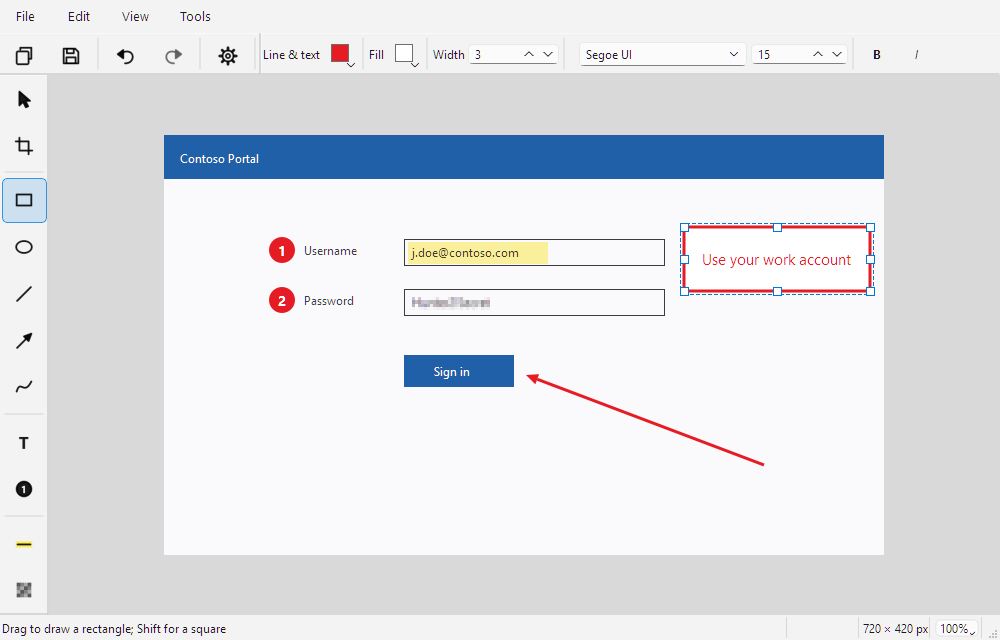
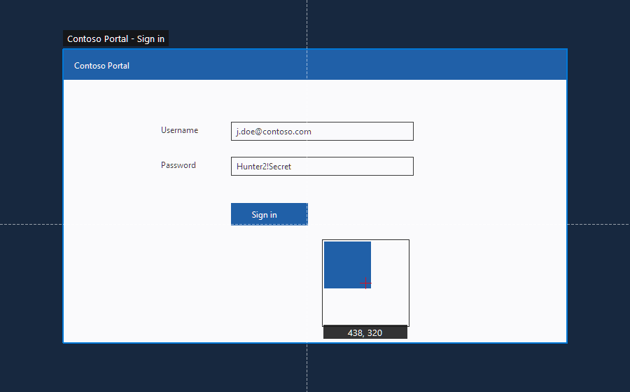
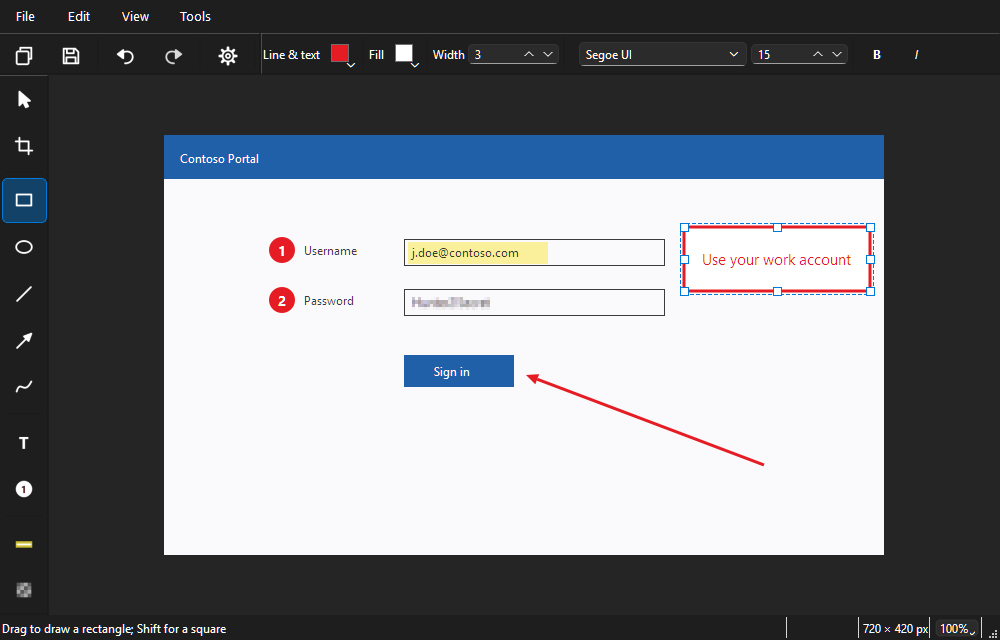
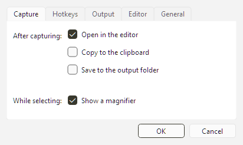

# VerdiClip

[](https://github.com/mikejhill/verdiclip/actions/workflows/ci.yml)
[](https://pypi.org/project/verdiclip/)
[](https://pypi.org/project/verdiclip/)
[](LICENSE)

Fast, faithful screenshots for Windows: grab a precise piece of the screen, mark it up, and put it where it needs to go — in seconds.



VerdiClip is an independent project. See [ATTRIBUTION.md](ATTRIBUTION.md) for credits.

## Install

Requires Windows 10 or later and Python 3.13+.

```bash
uv tool install verdiclip
```

Or with pip: `pip install verdiclip`. Then run `verdiclip` (or `verdiclip-gui` for no console window) and VerdiClip sits in the system tray.

## Capture

| Do this | Press |
| --- | --- |
| Drag a region, or click a window | `PrtSc` (or left-click the tray icon) |
| Capture the active window | `Alt+PrtSc` |
| Capture every monitor | `Ctrl+PrtSc` |
| Repeat the last capture | `Shift+PrtSc` |



While selecting, the screen is frozen so you get exactly what you saw. A magnifier follows the cursor, arrow keys nudge it by a pixel (`Ctrl` for 10), clicking without dragging captures the window under the cursor, and `Esc` cancels.

If Windows or another screenshot tool already owns `PrtSc`, VerdiClip tells you which hotkeys are taken; everything is still available from the tray menu, and you can choose other keys in Settings.

## Annotate

| Tools | | Actions | |
| --- | --- | --- | --- |
| `V` Select | `T` Text | `Ctrl+Shift+C` Copy image | `Ctrl+Z` / `Ctrl+Y` Undo / redo |
| `C` Crop | `N` Counter | `Ctrl+S` Save (auto-named) | `Ctrl+C` / `Ctrl+V` Copy / paste marks |
| `R` Rectangle | `H` Highlight | `Ctrl+Shift+S` Save as | `Delete` Remove selection |
| `E` Ellipse | `O` Obfuscate | `Ctrl+P` Print | Arrows Nudge (`Ctrl` = 10 px) |
| `L` Line | `F` Freehand | `Ctrl+wheel` Zoom | `Space`+drag Pan |
| `A` Arrow | | `Ctrl+0` / `Ctrl+Shift+F` 100% / fit | `Esc` Back out one step |
| | | `Ctrl+R` / `Ctrl+Shift+R` Rotate right / left | `Ctrl+Shift+H` / `Ctrl+Shift+V` Flip |
| | | `Ctrl+Alt+I` Resize | |

- **Labels in boxes.** After drawing a rectangle or ellipse, just type — the text is centered and wraps inside it. Double-click (or `Enter`/`F2`) to edit later; `Esc` skips.
- **Shift** draws squares, circles, and 45° lines.
- **Your styles stick.** Colors, fills, widths, and fonts you pick are remembered per tool for the next screenshot.
- **Rotate, flip, and resize** from the Image menu or the toolbar's Image button. Your marks turn and scale with the picture; text stays upright. Resize works on what you see (after cropping), in pixels or percent, keeping the aspect ratio unless you untick it.
- **Everything is undoable**, including crop, which never throws pixels away.
- **The quickest path**: draw, `Esc` until nothing is selected, `Enter` — the image is on the clipboard and the editor closes. Closing an image you haven't copied or saved asks first (you can turn this off in Settings → Editor).



## Settings

Open from the tray menu or with `Ctrl+,` in any editor.



- **After capturing** — any combination of: open in the editor, copy to the clipboard, save to the output folder.
- **Hotkeys** — validated as you type; conflicts are reported.
- **Output** — folder, file-name pattern (`{date}`, `{time}`, `{title}`, `{counter}`) with a live preview, format, JPEG quality.
- **Editor** — default color, width, and font.
- **General** — light, dark, or match-Windows theme; start at sign-in; show VerdiClip in Explorer's **Open with** menu for images. **Make VerdiClip the default image app…** opens Windows Settings at VerdiClip's Default apps page, where you choose it as the default (Windows requires you to confirm this yourself).

## Command line

```bash
verdiclip capture screen -o shot.png
verdiclip capture region --region 0,0,1280,720 --clipboard
verdiclip capture window --delay 3
verdiclip open picture.png          # Opens in the running instance if there is one
```

## How it is built

Start with [docs/design/philosophy.md](docs/design/philosophy.md): the core purpose, the principles, and the architecture. [docs/design/ux-contract.md](docs/design/ux-contract.md) specifies every interaction; each item has an automated journey test.

In short: an edit session is an immutable base image, a non-destructive crop, and a list of immutable annotation values. The only way to change it is a command through the undo history, and one renderer draws both the canvas and the exported image.

## Development

Requires Windows 10+ and [uv](https://docs.astral.sh/uv/).

```bash
uv sync                  # Create .venv and install dependencies
uv run verdiclip         # Run the tray app
uv run poe               # List tasks
uv run poe fix           # Format and auto-fix lint
uv run poe check         # Format check, lint, strict type check, tests with coverage
uv run poe ux            # UX journey tests only
uv run poe ux-snapshots  # Journeys plus a PNG per step in docs/ux/snapshots
uv run poe ux-gallery    # Key screens in light and dark themes (docs/ux/gallery)
```

`uv run poe check` is the quality gate: ruff (broad rule set), ty with every rule at error, and pytest with ≥ 90% branch coverage. Regenerate the README screenshots with `uv run python scripts/ux_gallery.py --readme-dir docs/images`. Before a release, also run the manual checklist at the end of the UX contract. See [CONTRIBUTING.md](CONTRIBUTING.md) for commit conventions and releases.

## License

[MIT](LICENSE)
